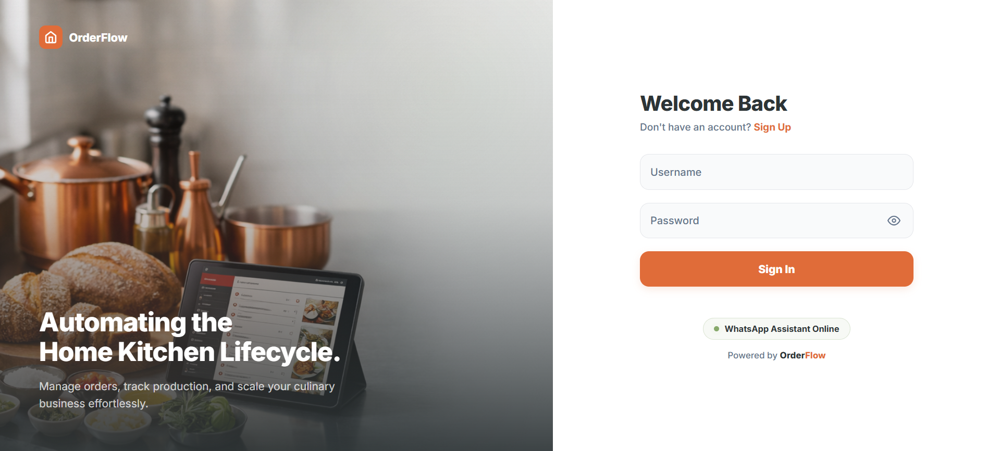
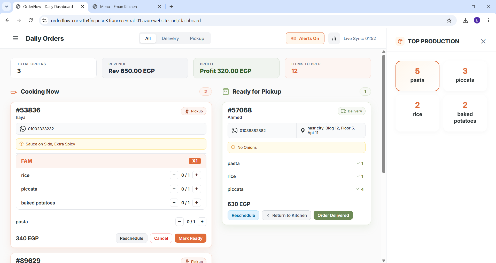
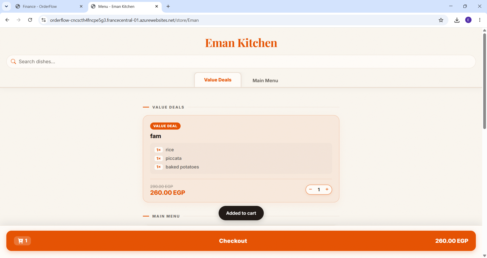
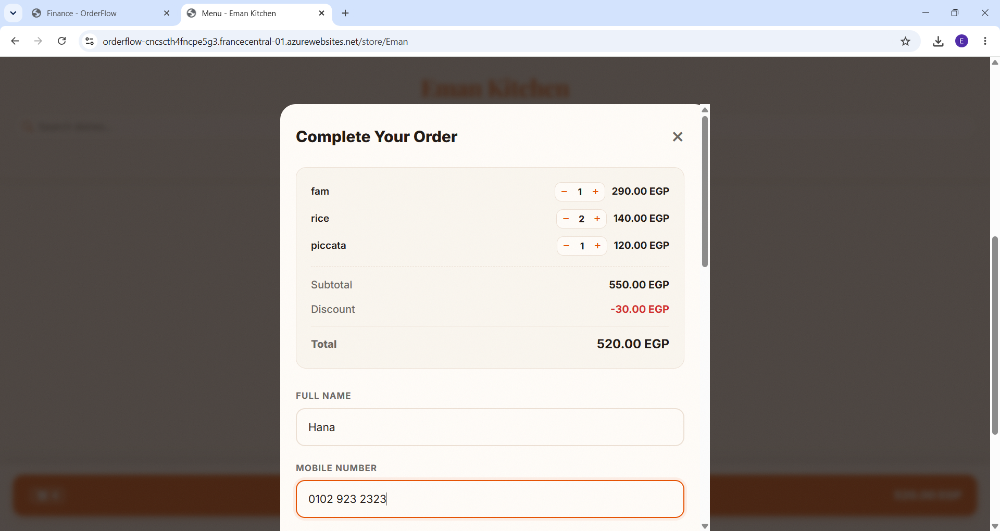
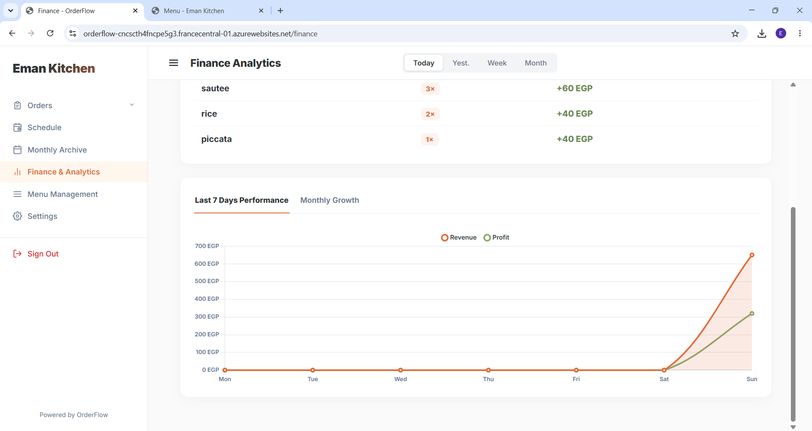

<div align="center">

# OrderFlow

### A SaaS platform for home-based food businesses and cloud kitchens —
### designed so every kitchen owner feels like they have a team behind them.

<br>

**👇 Click below to explore the live app!** <br>


[](https://orderflow-cncscth4fncpe5g3.francecentral-01.azurewebsites.net)

<br>

> 💡 **Demo Note:** The platform is currently optimized for desktop viewing and ready to explore! Mobile is functional but still a work in progress.

>
> Try a storefront: `…/store/{your-username}`

</div>

---

## What Is OrderFlow?

OrderFlow is a **multi-tenant order management platform** built for Egypt's home kitchen and cloud restaurant scene. Each kitchen owner gets their own branded storefront, a live operations dashboard, schedule control, and a finance overview — without needing to touch any code.

We **architected the core system together** to handle multi-tenancy seamlessly. Following that, my focus shifted to leading **the frontend development** — designing and building the entire experience, from the kitchen owner's dashboard to the customer's storefront.

---

---

## Screenshots

### Login

Split-layout entry point — full-height food photography, brand tagline, and a WhatsApp assistant indicator that sets the tone before the kitchen owner ever logs in.

<table align="center">
  <tr>
    <td></td>
  </tr>
</table>

### Kitchen Dashboard

The operations hub — kanban order flow, item-level progress tracking, daily metrics, and the Top Production leaderboard open in context as a slide-in drawer.

<table align="center">
  <tr>
    <td></td>
  </tr>
</table>

### Customer Storefront

Two screens, one journey — browsing the menu through to placing an order.

<table align="center">
  <tr>
    <th align="center">Menu</th>
    <th align="center">Checkout</th>
  </tr>
  <tr>
    <td></td>
    <td></td>
  </tr>
</table>

### Finance Dashboard

Revenue and profit breakdown across daily, weekly, monthly, and yearly timeframes with per-item performance.

<table align="center">
  <tr>
    <td></td>
  </tr>
</table>

---

## Features

### Kitchen Dashboard
- **Daily & Weekly Order Views** — see exactly what needs to be cooked and when
- **Item-level Progress Tracking** — mark each dish as prepared individually
- **Order Status Flow** — `Pending` → `Ready for Pickup` → `Completed`
- **Inline Rescheduling** — shift delivery date/time without leaving the view

### Public Storefront
- Every kitchen gets a unique URL: `/store/{username}`
- Customers browse the menu, pick items or packages, and choose a delivery slot
- Only available time windows are shown — no dead ends for the customer
- No login required — completely frictionless ordering

### Menu & Package Management
- Add, edit, and delete items with pricing and cost fields
- Build bundle packages with discounted pricing
- Toggle availability — disabling an item auto-disables its packages

### Schedule Management
- Set working hours per day across a rolling 7-day window
- Mark off-days — immediately reflected on the public storefront
- Prevents customers from selecting unavailable time slots

### Finance Dashboard
- Revenue and profit charts across daily, weekly, monthly, and yearly views
- Per-item performance — see which dishes sell most and earn most
- Pricing is frozen at order time for accurate historical reporting

---

## Tech Stack

| Layer | Technology |
|---|---|
| **Templates** | Jinja2 (server-side HTML rendering) |
| **Interactivity** | Vanilla JavaScript (per-page modules) |
| **Styling** | Custom CSS — scoped per page |
| **Backend** | Python + FastAPI  |
| **Database** | SQLite |
| **Deployment** | Azure App Service |

---

## UI/UX — What I Built

The goal went beyond just building screens. We mapped out the logic for two complete user journeys, translating that foundation into a custom visual design.

### Journey 1 — The Kitchen Owner

A busy home cook shouldn't have to fight their software. I designed the owner-side around **speed and clarity** — at a glance, they know exactly what orders are coming in, what needs to be cooked, and what's already done.

**Key design decisions:**
- **Dashboard-first layout** — the most critical info (today's orders, item statuses) is front and center, not buried in a menu
- **Visual order status flow** — `Pending → Ready for Pickup → Completed` designed as a clear visual progression, not just a dropdown
- **Item-level progress tracking** — each dish gets its own check-off, so nothing slips through during a busy prep session
- **Daily & Weekly toggle** — two views, one purpose: always knowing what's ahead
- **Inline rescheduling** — owners can shift an order's time without leaving the dashboard

### Journey 2 — The Customer

The storefront is the first impression a kitchen makes. The design prioritizes an effortless and trustworthy experience — no account needed, no confusion, just browse and order.

**Key design decisions:**
- Clean menu browsing with clear item and package distinction
- Delivery slot selection that only shows available times, synced with the kitchen's schedule
- No login wall — customers go from landing to checkout without interruption


---


## User Flow

### Kitchen Owner

```
Sign Up
   |
   v
Set Up Menu (Items + Packages)
   |
   v
Configure Schedule (Working Hours + Off-Days)
   |
   v
Share Storefront URL  ──────────────────────────────────> Customer Places Order
   |                                                               |
   v                                                               v
Dashboard: View Incoming Orders  <─────────────────────  Order Appears in Dashboard
   |
   v
Track Item-by-Item Preparation
   |
   v
Mark Order: Ready for Pickup → Completed
   |
   v
Finance Dashboard: Review Revenue + Performance
```

### Customer

```
Visit /store/{username}
   |
   v
Browse Menu (Items + Packages)
   |
   v
Select Delivery Date & Time (available slots only)
   |
   v
Submit Order
   |
   v
Order Confirmed
```


## Design System

The full color system, sourced directly from the CSS variables defined in the dashboard stylesheet.

### Brand & Accent

| Swatch | Variable | Hex | Usage |
|---|---|---|---|
|  | `--accent-primary` | `#E06C39` | Burnt Sienna — CTAs, active nav, highlights, badges |
|  | `--accent-hover` | `#C05621` | Darker Terracotta — pressed and hover states |
|  | `--sage-green` | `#87A96B` | Sage Green — "Ready" column, positive/complete states |
|  | `--sage-dark` | `#6D8A56` | Darker Sage — sage hover and action buttons |

### Backgrounds & Surfaces

| Swatch | Variable | Hex | Usage |
|---|---|---|---|
|  | `--bg-canvas` | `#FAFAFA` | Off-White Cream — page canvas across all views |
|  | — | `#FFFFFF` | Pure White — sidebar, cards, headers, modals |
|  | — | `#FFF7ED` | Warm Tint — active nav items, enabled state backgrounds |
|  | — | `#F3F4F6` | Neutral Light — inactive tabs, input backgrounds, chips |

### Typography

| Swatch | Variable | Hex | Usage |
|---|---|---|---|
|  | `--slate-dark` | `#2D3436` | Deep Charcoal — headings, primary body text |
|  | `--slate-muted` | `#64748B` | Muted Slate — labels, captions, secondary info |

### Borders & Structure

| Swatch | Variable | Hex | Usage |
|---|---|---|---|
|  | `--border-color` | `#E5E7EB` | Default border — cards, dividers, inputs |

### Status & Feedback

| Swatch | Hex | Usage |
|---|---|---|
|  | `#DC2626` | Error / Late orders — red border and background tint |
|  | `#FFFBEB` | Warning / Notes — amber-tinted alert background |
|  | `#EFF6FF` | Info / Address — blue-tinted alert background |

### Design Decisions

The palette splits into two distinct emotional tracks. The **warm side** — Burnt Sienna, Terracotta, and Off-White Cream — handles urgency and action: every button, badge, and active state. The **cool side** — Sage Green, Charcoal, and Muted Slate — handles completion and structure: the "Ready" column, text hierarchy, and layout scaffolding. The result is a UI where the user always knows what needs attention and what's already handled, without a single word of instruction.


---

## Frontend Structure

```
order_flow/
├── static/
│   ├── css/                 # Individual stylesheet per page
│   ├── js/                  # Individual script per page
│   └── images/              # UI assets and backgrounds
│
└── templates/               # Jinja2 HTML templates
    ├── dashboard.html        # Daily order management
    ├── weekly_dashboard.html # Weekly view
    ├── finance.html          # Charts & revenue breakdown
    ├── history.html          # Order history log
    ├── menu.html             # Menu & package editor
    ├── schedule.html         # Working hours manager
    ├── store.html            # Customer-facing storefront
    ├── settings.html         # Kitchen profile settings
    ├── login.html
    └── signup.html
```

---

## Page-by-Page Architecture

The frontend architecture relies on 10 distinct templates, each with its own scoped stylesheet. No bloated global CSS — every page loads only what it needs.

| Page | Purpose | Design Focus |
|---|---|---|
| `login.html` | Kitchen owner sign-in | Trust, clarity, brand entry point |
| `signup.html` | New kitchen registration | Minimal fields, low friction |
| `dashboard.html` | Daily order management | Speed, density, zero ambiguity |
| `weekly_dashboard.html` | Weekly overview | Scanning patterns across 7 days |
| `menu.html` | Menu & package management | Control, hierarchy, quick edits |
| `schedule.html` | Working hours & off-days | Calendar-like clarity |
| `finance.html` | Revenue & profit charts | Data readability, visual hierarchy |
| `history.html` | Past order log | Scannable, filterable records |
| `settings.html` | Kitchen profile | Clean form design |
| `store.html` | Public customer storefront | Customer trust, ease of ordering |


------


## Source Code

OrderFlow is an active, proprietary SaaS platform, so the source code is kept private to protect the business logic.

You can fully explore the platform via the Live Demo. Feel free to reach out to me if you would like to discuss the frontend architecture and UI/UX design, or connect with my co-founder Fares to dive deeper into the FastAPI backend and deployment!

---

## Roadmap

- [ ] Mobile responsive redesign
- [ ] Push notifications UI for new orders
- [ ] WhatsApp order alert integration
- [ ] Customer order history portal
- [ ] Pagination on history and order lists
- [ ] Custom domain

---

## Team

| Role | Contributor |
|---|---|
| **Frontend Development & UI/UX Design** | [Eman](https://github.com/eman383) |
| **Backend Development & Deployment** | [Fares](https://github.com/faresmoustafa1) |


<div align="center">

Designed and built for Egypt's home kitchens and cloud restaurants.

</div>
